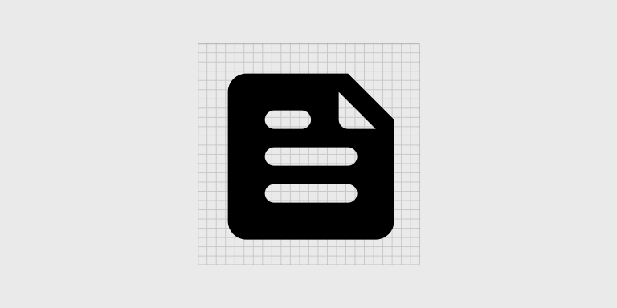

Bike Diary's design is meant to be content-focused and straightforward, without too much motion and color. So instead, we used a grayscale color palette to make the photographs stand out and a typographic scale that makes headlines and long texts easy to read. Any additional color is used to indicate information.

## Navigation

The application has a standard bottom navigation for navigating between main sections.

We currently have four main sections:

- Dashboard
- Feeds
- Map
- Profile

Any other section has an arrow for navigating back to the main sections
except for the Authentication screen.

### Dashboard section

### Feeds section

### Map section

### Profile section

## Color

The app has custom colors for light and night themes. But on Android version 12 and higher, users can use dynamic colors. Learn more about [dynamic colors](https://m3.material.io/styles/color/dynamic-color/overview).

## Typography

The app uses Roboto as the typeface and made use the material design 3 type scaling system.

The type scale is organise into five roles:

- Display
- Headline
- Title
- Label
- Body

Each role has a small, medium, and large scale variate.

| Role            | Font size | Tracking | Font weight | Line-height |
| --------------- | --------- | -------- | ----------- | ----------- |
| Display large   | 57sp      | 0        | Regular     | 64          |
| Display medium  | 45sp      | 0        | Regular     | 52          |
| Display small   | 36sp      | 0        | Regular     | 44          |
| Headline large  | 32sp      | 0        | Regular     | 40          |
| Headline medium | 28sp      | 0        | Regular     | 36          |
| Headline small  | 24sp      | 0        | Regular     | 32          |
| Title large     | 22sp      | 0        | Regular     | 28          |
| Title medium    | 16sp      | 0.15     | Medium      | 24          |
| Title small     | 14sp      | 0.1      | Medium      | 20          |
| Label large     | 22sp      | 0.1      | Medium      | 20          |
| Label medium    | 16sp      | 0.5      | Medium      | 16          |
| Label small     | 14sp      | 0.5      | Medium      | 6           |
| Body large      | 16sp      | 0.15     | Medium      | 24          |
| Body medium     | 14sp      | 0.25     | Medium      | 20          |
| Body small      | 12sp      | 0.4      | Medium      | 16          |

## Iconography

The application uses [material design icons](https://fonts.google.com/icons), and custom icons follow the material design guidelines.

## Shape

## Components

## Motion
