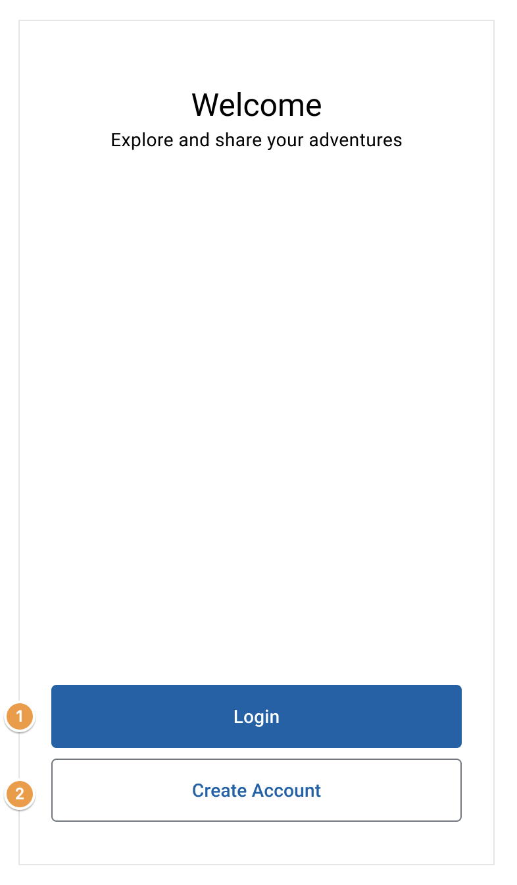

## Access the login and registration page

### Story

**As a** user
**I want to** access the login and registration form
**in order to** fill in the fields

### Functional specifications for the authentication portal page

| Number | Field          | Action                       |
| ------ | -------------- | ---------------------------- |
| 1      | Login          | Access the login form        |
| 2      | Create Account | Access the registration form |

### Acceptance criteria

**1-Accessing the login form** 
_When_ I am on the authentication portal page 
_And_ click on the "Login" button 
_Then_ I arrive on the login page 

**2-Accessing the account creation form** 
_When_ I am on the authentication portal page 
_And_ click on the "Create Account" button 
_Then_ I arrive on the account creation page 
