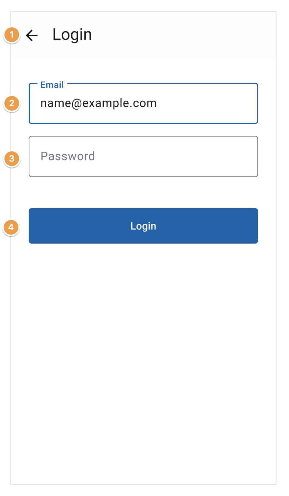

## Log in to a user account

### Story

**As a** user
**I want to** fill in the login form
**in order to** be authenticated

### Functional specifications

| Number | Field      | Required | Actions           | Rules of engagement                     |
| ------ | ---------- | -------- | ----------------- | --------------------------------------- |
| 1      | Back arrow | N/A      | Navigate back     | N/A                                     |
| 2      | Email      | Yes      | N/A               | should be an email                      |
| 3      | Password   | Yes      | N/A               | at least 8 characters                   |
| 3      | Login      | N/A      | Authenticate user | verify all fields before authentication |

### Acceptance criteria

1. [Successful login](#1-successful-login)
2. [Empty fields error case](#2-empty-fields-error-case)
3. [Incorrect email format error case](#3-incorrect-email-format-error-case)
4. [Unknown email error case](#4-unknown-email-error-case)
5. [Unknown password error case](#5-unknown-password-error-case)

#### 1. Successful login 

_When_ I am on the login page 
_And_ enter a known email with the correct password 
_And_ click on the "Login" button 
_Then_ I receive a success message and arrive on the dashboard page 

#### 2. Empty fields error case 

_When_ I am on the login page 
_And_ have empty fields 
_And_ click on the "Login" button 
_Then_ I remain on the login page and have error message(s) under the field(s)

#### 3. Incorrect email format error case 

_When_ I am on the login page 
_And_ enter an incorrect email in the email field 
_And_ click on the "Login" button 
_Then_ I remain on the login page with error message(s) under the field(s)

#### 4. Unknown email error case 

_When_ I am on the login page 
_And_ enter an unknown email with a password 
_And_ click on the "Login" button 
_Then_ I remain on the login page with an incorrect credentials error message

#### 5. Unknown password error case 

_When_ I am on the login page 
_And_ enter an known email with a wrong password 
_And_ click on the "Login" button 
_Then_ I remain on the login page with an incorrect credentials error message
